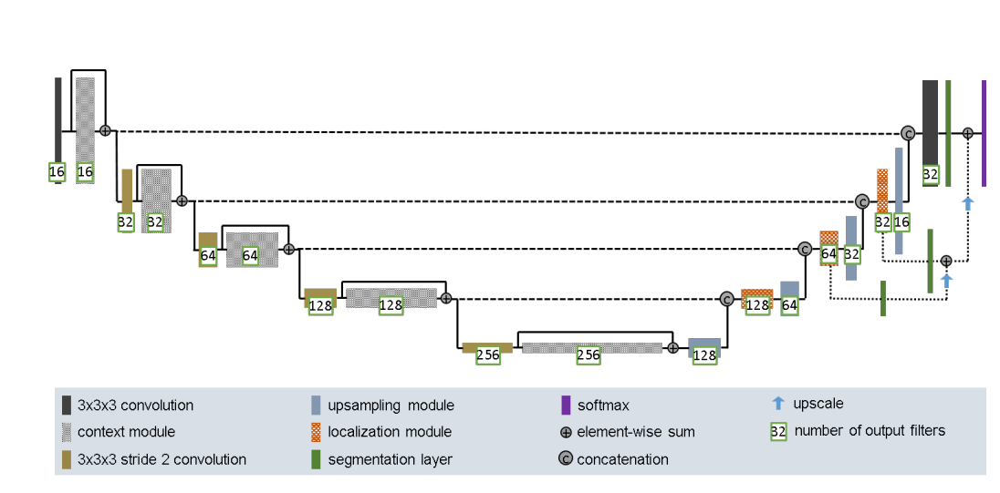
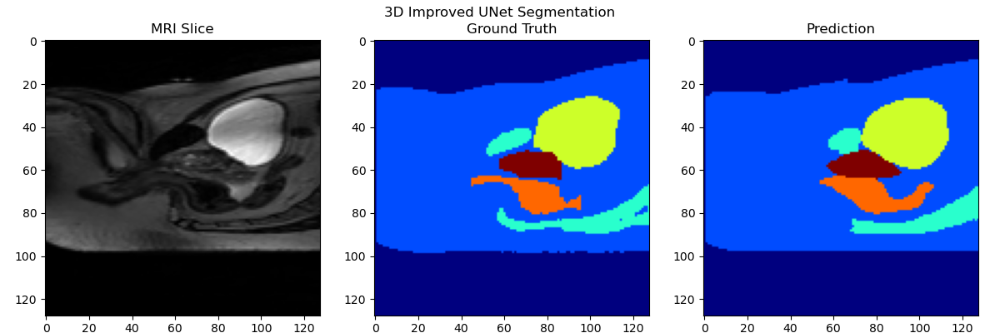
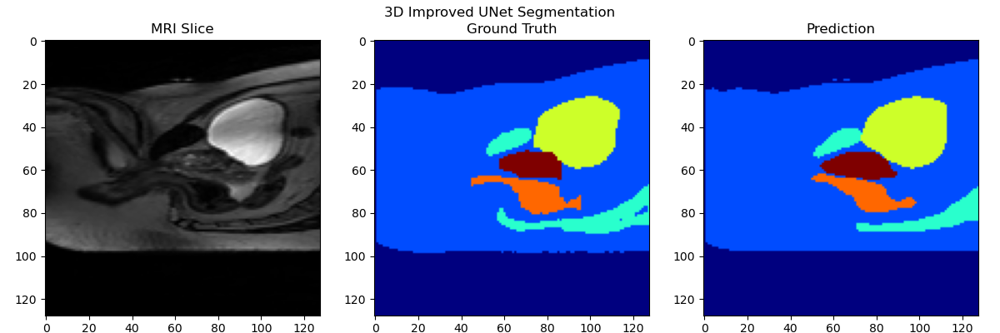
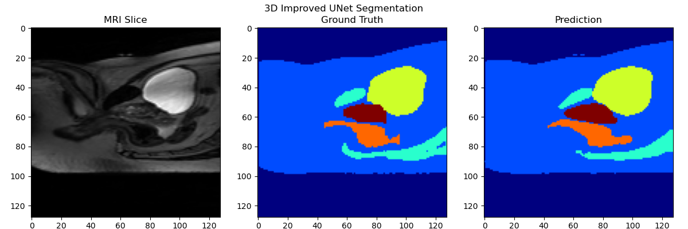
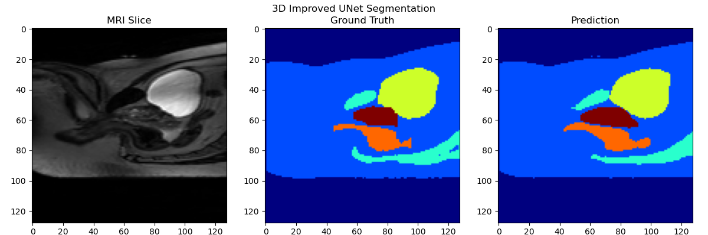
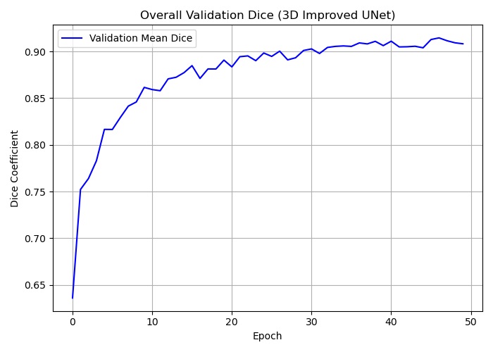
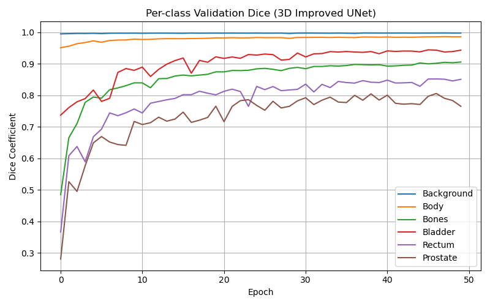
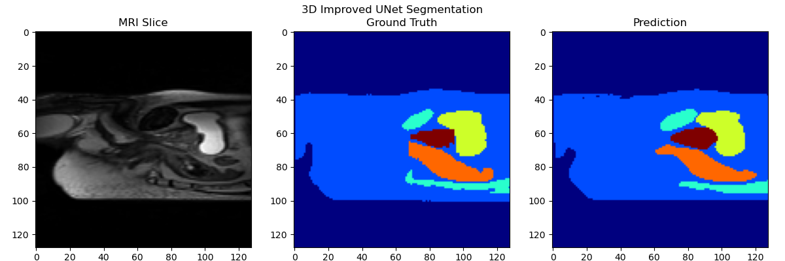
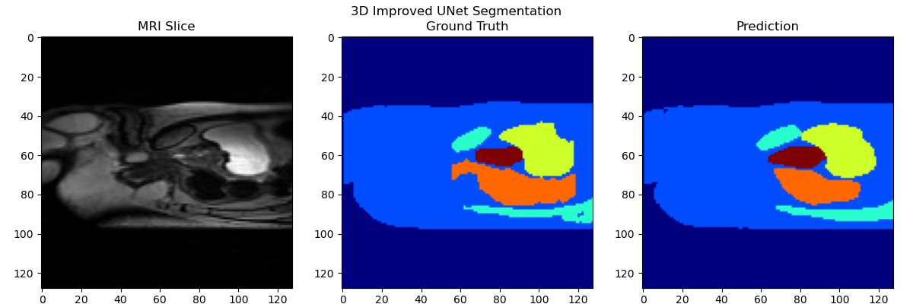
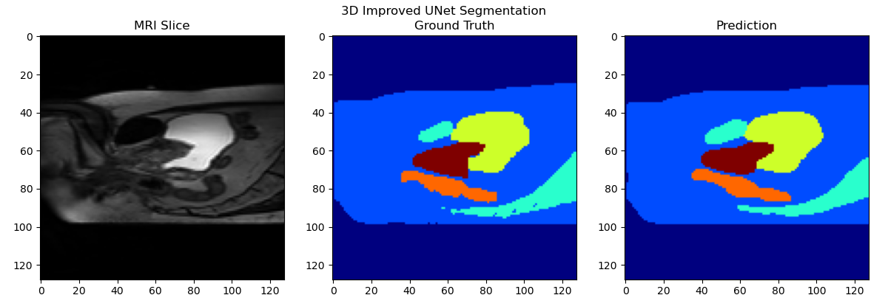

# 3D Prostate MRI Data Segmentation Using the 3D Improved U-Net Model

## 3D Improved U-Net

**U-Net** is a convolutional neural network (CNN) architecture initially developed to address biomedical image segmentation tasks. Its encoder-decoder structure, coupled with skip connections, enables the network to capture both fine-grained details for precise localization and broader context for a more comprehensive understanding. This dual capability makes U-Net highly effective for segmentation tasks where both spatial accuracy and contextual awareness are crucial ([Chornyi, 2024](https://codefinity.com/blog/2D-and-3D-U-Net-Architectures)). Additionally, the 3D U-Net can be trained efficiently since the model can be trained end-to-end with relatively few images, making it suitable for applications with limited annotated data ([Chornyi, 2024](https://codefinity.com/blog/2D-and-3D-U-Net-Architectures)).

The 3D U-Net extends the original architecture to handle three-dimensional volumetric data, such as CT and MRI scans. It processes data in all three spatial dimensions, capturing volumetric context ([Chornyi, 2024](https://codefinity.com/blog/2D-and-3D-U-Net-Architectures)).

The 3D U-Net model consists of an encoder and a decoder. A bottleneck layer between the encoder and decoder was avoided in the network architecture, instead using instance normalization for faster and more stable convergence during training ([Isensee et al., 2018](https://arxiv.org/pdf/1802.10508v1)).



### Encoder (Contracting Path)
The encoder, also known as the contracting path, captures contextual information by down sampling the input volume. Each stage of the encoder consists of two 3x3x3 convolutional layers followed by ReLU activations, and a 2x2x2 max pooling operation with a stride of two. At each down sampling step, the number of feature channels doubles, allowing the network to learn increasingly complex representations of the input data ([Isensee et al., 2018](https://arxiv.org/pdf/1802.10508v1)).

### Decoder (Expanding Path)
The decoder, also known as the expanding path, restores the spatial dimensions of the feature maps for precise localisation. Each step of the decoder includes up sampling the feature maps through a 2×2×2 up-convolution that halves the number of feature channels. Followed by concatenation with the corresponding feature maps from the encoder via skip connections ([Chornyi, 2024](https://codefinity.com/blog/2D-and-3D-U-Net-Architectures)).Skip connections provide an alternative data path that bypasses the convolutional backbone, which allows the model to combine high-resolution spatial details with broader contextual features ([Kamath et al., 2025](https://doi.org/10.1016/j.compbiomed.2025.111056)).As a result, the model can preserve information lost during down sampling and enhances segmentation accuracy by merging features which improves boundary detection and reduces loss of fine details ([Chornyi, 2024](https://codefinity.com/blog/2D-and-3D-U-Net-Architectures)). Skip connections also help with gradient flow, often speeding up training and improving overall performance ([Kamath et al., 2025](https://doi.org/10.1016/j.compbiomed.2025.111056)). Two additional 3×3×3 convolutions followed by ReLU activations refine these combined features ([Chornyi, 2024](https://codefinity.com/blog/2D-and-3D-U-Net-Architectures)).

### Output Layer
Finally, for the output layer a 1x1x1 convolution maps each feature vector to the desired number of labels ([Chornyi, 2024](https://codefinity.com/blog/2D-and-3D-U-Net-Architectures)).

## Loading Data

The dataset used in this project was the HipMRI study for prostate cancer radiotherapy. The dataset includes 38 patients with a total of 211 volumetric MRI scans. The segmentation covers the body outline, bone, bladder, rectum, and prostate regions, which were segmented in 3D by an MR physicist with more than 10 years of experience. The goal of the project was to segment the prostate 3D dataset with the 3D improved U-Net model, aiming for all labels to have a minimum Dice similarity coefficient of 0.7 on the test set.

The dataset was split into 80% for training, with the remaining 20% divided between validation and prediction sets ([FernandoPC25, 2024](https://medium.com/@fernandopalominocobo/mastering-u-net-a-step-by-step-guide-to-segmentation-from-scratch-with-pytorch-6a17c5916114)). The remaining 20% is used for model evaluation, 3 samples of the data were dedicated to prediction (test) to assess how well the model generalised to unseen data, while the remaining was used for validation during training. This split allowed for continuous monitoring and tuning of the model’s performance during training, while providing an independent test set for final performance evaluation.

---

## Training

### Dependencies
The following dependencies are required:
- `matplotlib 3.8.4`
- `nibabel 5.2.1`
- `numpy 1.26.4`
- `torch 2.0.1`
- `tqdm 4.65.0`
- `scipy 1.10.1`

### Reproducibility of Results
To reproduce the results displayed at the end of this file, ensure you are in the rangpur environment provided by the course. Install the required dependencies and download `dataset.py`, `modules.py`, `train.py`, and `predict.py` files from the repository.

To train, validate, test the 3D improved U-Net model, and save the trained model along with the statistics and plots, run:
```bash
sbatch train-runner
```

The train-runner script should contain the following:
```bash
#!/bin/bash
#SBATCH --nodes=1
#SBATCH --ntasks-per-node=1
#SBATCH --cpus-per-task=1
#SBATCH --gres=gpu:a100
#SBATCH --job-name=3D-UNet-model
#SBATCH -o results.out
#SBATCH --partition=a100
#SBATCH --time=02:00:00

python train.py
```

To load the test and trained 3D improved U-Net model, perform testing on the dataset, and save example visualisations, run:

```bash
sbatch predict-runner
```

The `predict-runner` script should contain the following:
```bash
#!/bin/bash
#SBATCH --nodes=1
#SBATCH --ntasks-per-node=1
#SBATCH --cpus-per-task=1
#SBATCH --gres=gpu:a100
#SBATCH --job-name=predict-3D-UNet-model
#SBATCH -o predict.out

python predict.py
```

## Results

The model was trained for 50 epochs with visualisations every 10 epochs to check progress, as shown below:

- Epoch 10: 
- Epoch 20: 
- Epoch 30: 
- Epoch 40: 
- Epoch 50: 

In addition, the overall validation dice coefficient across the 50 epochs is plotted below:



As expected, the coefficient increased during training.


Additionally, the per-class validation dice coefficients across the 50 epochs are plotted below:



As expected, the dice coefficients for every class increased during training.

---

## Testing

Three unseen samples were tested in `predict.py`. The results are shown below:

### Sample 0
- Per-class Dice Scores: [0.99833149, 0.98683143, 0.89724141, 0.85218036, 0.85911244, 0.47872341]
- Visualisation: 

### Sample 1
- Per-class Dice Scores: [0.9948405, 0.98069173, 0.90555626, 0.94768518, 0.86835349, 0.48975411]
- Visualisation: 

### Sample 2
- Per-class Dice Scores: [0.99726111, 0.98377687, 0.91158736, 0.93974024, 0.88424373, 0.87419766]
- Visualisation: 

As shown above, unfortunately, not all labels achieved the minimum requirement dice similarity coefficient of 0.7. Specifically sample 0 and sample 1 show lower scores for the last class (Prostate class).

### Overall Dice Similarity Coefficients for Test Samples:
- Background: 0.99681103
- Body: 0.98376667
- Bone: 0.90479501
- Bladder: 0.91320193
- Rectum: 0.87056988
- Prostate: 0.61422506

These scores show that the model performed well in segmenting most of the structures, with high dice coefficients. However, the prostate label shows a notably lower dice score of 0.61, suggesting that the model seemed to struggle in that particular region.

---

## Conclusion

In conclusion, the 3D improved U-Net model demonstrated strong performance in segmenting prostate MRI volumes, as evidenced by the high dice scores for most of the classes, with the dice scores being 0.87 or greater. However, performance varied for the prostate class, indicating room for improvement. Overall, the model performed well, but there is still variability in the segmentation quality for the prostate region.

---

## Improvements

While the current model demonstrates solid performance for larger structures such as the body, the model’s performance on smaller regions like the prostate is not as good. To improve this, several optimisations could be made, including more augmentations of the dataset like elastic deformations, and the use of weighted loss functions could help place more emphasis on underrepresented classes like the prostate.

---

## References

- Chornyi, A. (2024, November). [2D and 3D U-Net Architectures](https://codefinity.com/blog/2D-and-3D-U-Net-Architectures).
- FernandoPC25. (2024, April 25). [Mastering U-Net: A Step-by-Step Guide to Segmentation from Scratch with PyTorch](https://medium.com/@fernandopalominocobo/mastering-u-net-a-step-by-step-guide-to-segmentation-from-scratch-with-pytorch-6a17c5916114).
- Isensee, F., Kickingereder, P., Wick, W., Bendszus, M., & Maier-Hein, K. (2018). [Brain Tumor Segmentation and Radiomics Survival Prediction: Contribution to the BRATS 2017 Challenge](https://arxiv.org/pdf/1802.10508v1).
- Kamath, A., Willmann, J., Andratschke, N., & Reyes, M. (2025). [The Impact of U-Net Architecture Choices and Skip Connections on the Robustness of Segmentation Across Texture Variations](https://doi.org/10.1016/j.compbiomed.2025.111056).
